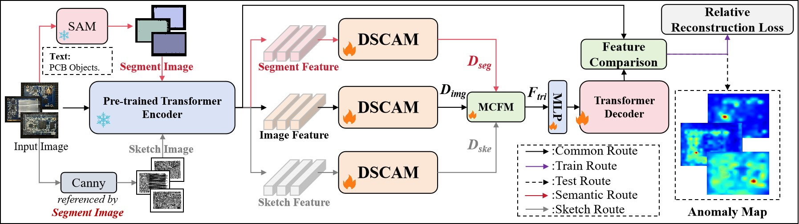
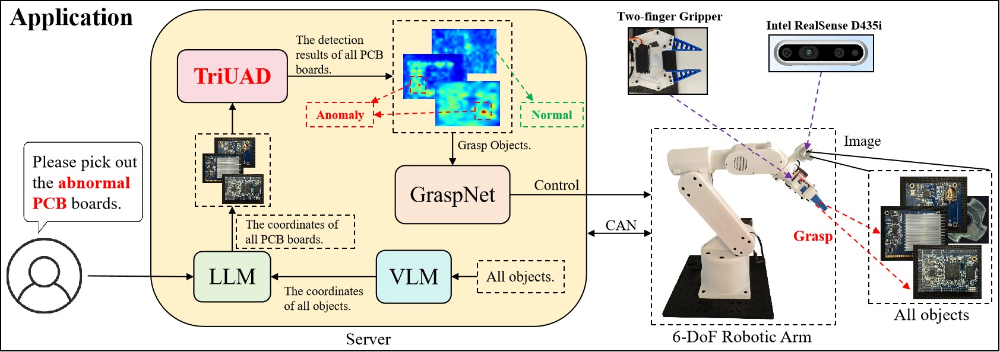
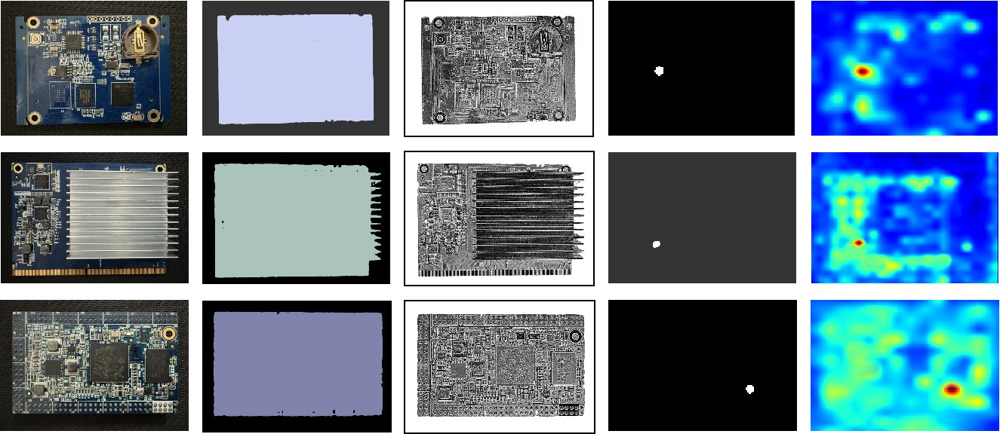
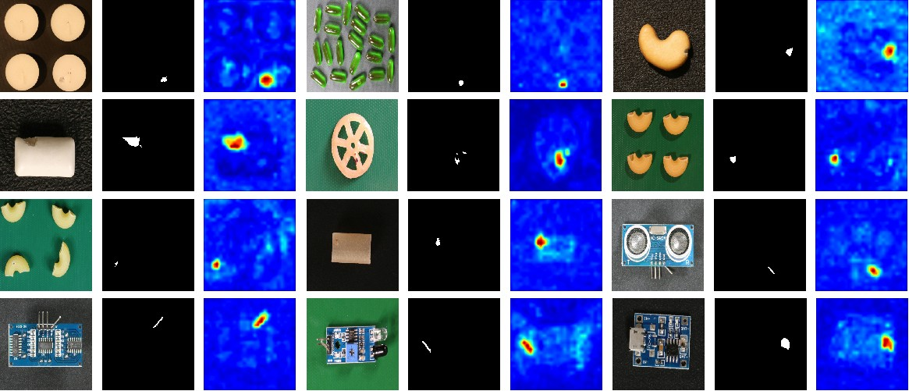
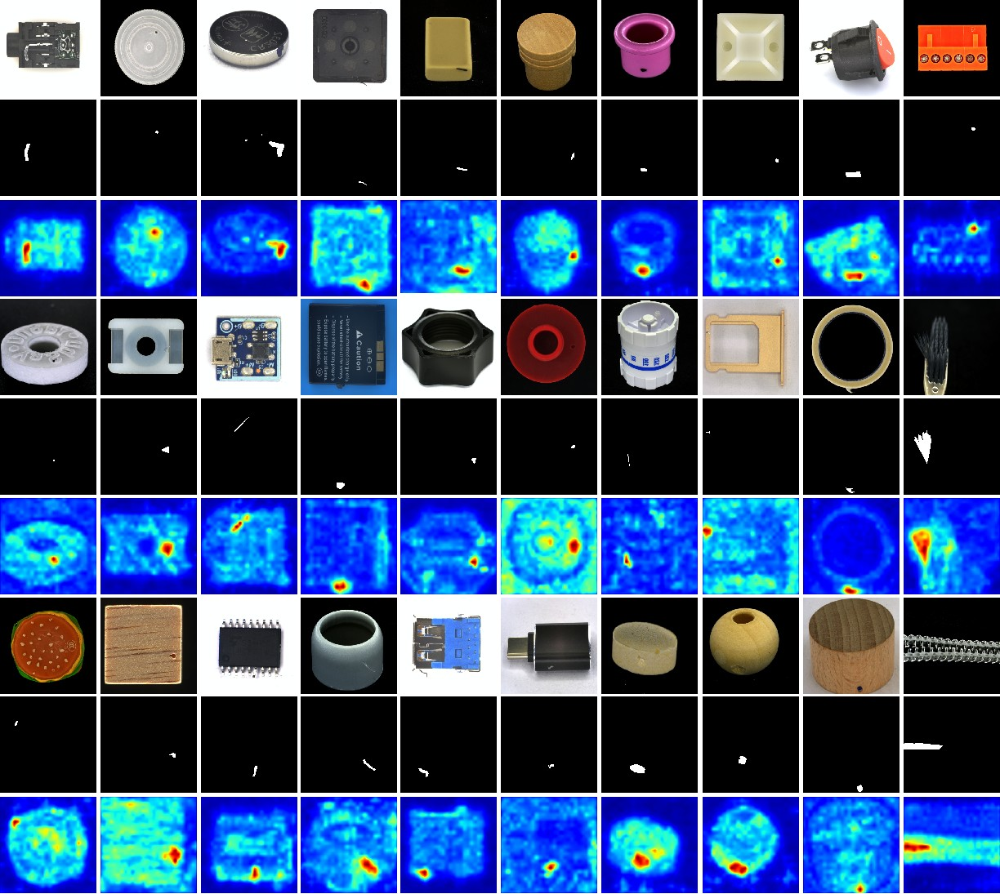
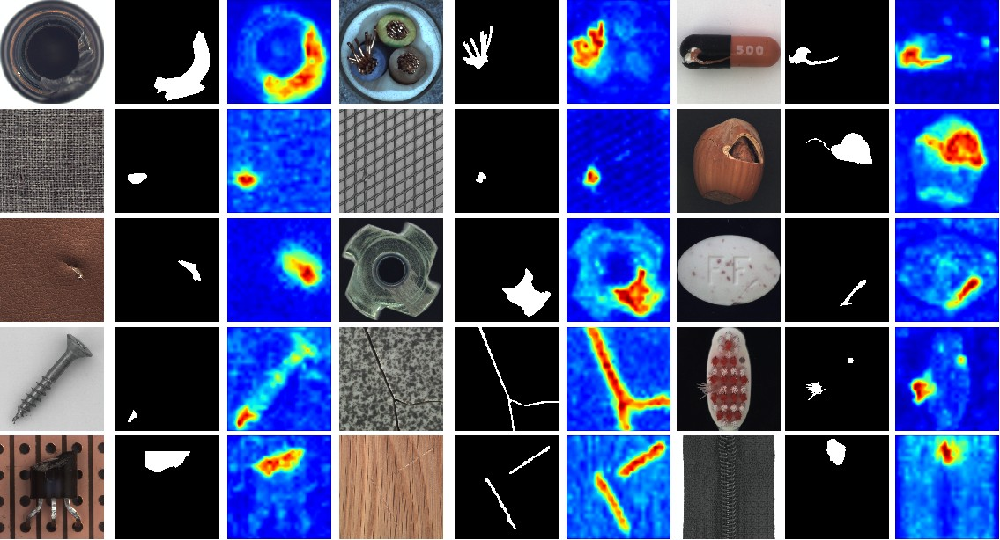

## Overview
<p align="center">
  
</p>
<p align="center">
  
</p>

## Install Environments

Create a new conda environment and install required packages.

```
conda create -n TriUAD python=3.8.12
conda activate TriUAD
pip install -r requirements.txt
```
Experiments are conducted on NVIDIA GeForce RTX 3090Ti (24GB). Same GPU and package version are recommended. 

## Prepare Datasets
Noted that `../` is the upper directory of TriUAD code. It is where we keep all the datasets by default.
You can also alter it according to your need, just remember to modify the `data_path` in the code. 

### MVTec AD

Download the MVTec-AD dataset from [URL](https://www.mvtec.com/company/research/datasets/mvtec-ad).
Unzip the file to `../mvtec_anomaly_detection`.
```
|-- mvtec_anomaly_detection
    |-- bottle
    |-- cable
    |-- capsule
    |-- ....
```


### VisA

Download the VisA dataset from [URL](https://github.com/amazon-science/spot-diff).
Unzip the file to `../VisA/`. Preprocess the dataset to `../VisA_pytorch/` in 1-class mode by their official splitting 
[code](https://github.com/amazon-science/spot-diff). `../VisA_pytorch` will be like:
```
|-- VisA_pytorch
    |-- 1cls
        |-- candle
            |-- ground_truth
            |-- test
                    |-- good
                    |-- bad
            |-- train
                    |-- good
        |-- capsules
        |-- ....
```
 
### Real-IAD
Contact the authors of Real-IAD [URL](https://realiad4ad.github.io/Real-IAD/) to get the net disk link.

Download and unzip `realiad_1024` and `realiad_jsons` in `../Real-IAD`.
`../Real-IAD` will be like:
```
|-- Real-IAD
    |-- realiad_1024
        |-- audiokack
        |-- bottle_cap
        |-- ....
    |-- realiad_jsons
        |-- realiad_jsons
        |-- realiad_jsons_sv
        |-- realiad_jsons_fuiad_0.0
        |-- ....
```
## Experiments
### Options
- `dataset`: names of the datasets, MVTec-AD, VisA, or Real-IAD
- `data_path`: path to the dataset
- `encoder`: name of the pretrained encoder
- `input_size`: size of the image after resizing
- `crop_size`: size of the image after center cropping
- `total_epochs`: number of training epochs
- `batch_size`: batch size
- `phase`: mode, train or test
- `shot`: number of samples per class in the few-shot setting
- `source_dataset`: name of the pre-trained dataset in the zero-shot setting
### Train & Test Setting
<details>
<summary>
MVTec-AD
</summary>

#### Train:
```
python TriUAD_Multi_Class.py --dataset MVTec-AD --data_path ../mvtec_anomaly_detection --phase train
```
#### Test:
```
python TriUAD_Multi_Class.py --dataset MVTec-AD --data_path ../mvtec_anomaly_detection --phase test
```
</details>

<details>
<summary>
VisA
</summary>

#### Train:
```
python TriUAD_Multi_Class.py --dataset VisA --data_path ../VisA_pytorch/1cls --phase train
```
#### Test:
```
python TriUAD_Multi_Class.py --dataset VisA --data_path ../VisA_pytorch/1cls --phase test
```
</details>

<details>
<summary>
Real-IAD
</summary>

#### Train:
```
python TriUAD_Multi_Class.py --dataset Real-IAD --data_path ../Real-IAD --phase train
```
#### Test:
```
python TriUAD_Multi_Class.py --dataset Real-IAD --data_path ../Real-IAD --phase test
```
</details>


## Results
### Locatization Results on the PCB dataset
<p align="center">
  
</p>
### Locatization Results on the VisA dataset
<p align="center">
  
</p>
### Locatization Results on the Real-IAD dataset
<p align="center">
  
</p>
### Locatization Results on the MVTec-AD dataset
<p align="center">
  
</p>


## Acknowledgements
We sincerely appreciate [Dinomaly](https://github.com/guojiajeremy/Dinomaly) for its concise, effective, and easy-to-follow approach. 

